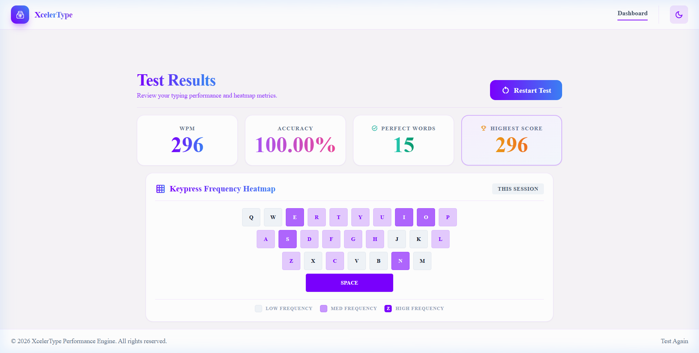
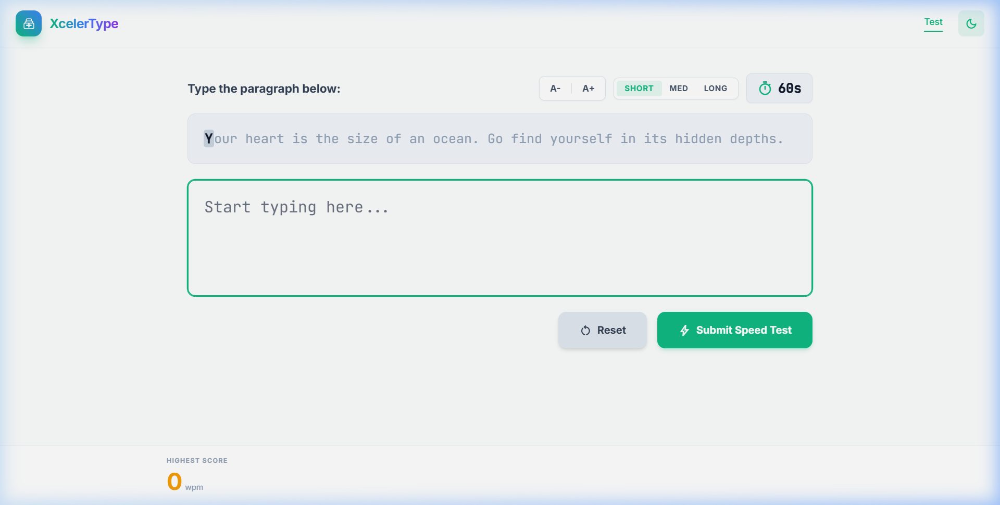

# XcelerType



A dynamic, minimalist Spring Boot web application designed to track and improve your keyboard typing speed and accuracy in real-time. Built specifically around a clean MVC architecture under Java 21, the application requires absolutely no database setup to operate out of the box.

## Features

- **Character-Level Accuracy Tracking:** The application tracks your typing live, character by character. Correct letters glow a vibrant green, while typos immediately flag a bold red indicator.
- **Dynamic Network Text Generation:** Forget static coding strings! XcelerType performs synchronous network calls to the public DummyJSON Quotes API to dynamically stitch together new layouts depending on the test size you prefer.
- **Adjustable Test Lengths:** Cycle between Short (1 quote), Med (3 quotes), and Long (5 quotes) testing constraints on the fly.
- **Responsive Typography Control:** A stateful `A- / A+` controller actively scales the test environment's UI parameters. Your sizing preferences are safely cached in the browser's Local Storage!
- **Persistent Anti-bfcache System:** Leveraging Javascript `pageshow` global listeners, the internal counting mechanisms cannot be falsely triggered or preserved via browser caching behavior!
- **Post/Redirect/Get Pattern:** Refreshing the results dashboard cleanly redirects back to the home page without form resubmission warnings.

## Demonstration Screenshots

### The Typing Interface (A+ Text Scaling Active)


## Technology Stack

- **Backend Architecture:** Spring Boot (Java 21)
- **MVC Templating:** Thymeleaf
- **Frontend UI:** Tailwind CSS (via CDN) & Vanilla JavaScript
- **Build Tool:** Maven

## Getting Started

Because XcelerType intentionally omits a database configuration, launching the application is straightforward and immediate.

### Prerequisites

You will need the following installed on your machine:
- Java JDK 21
- Apache Maven

### Installation & Run

1. Clone or download this repository to your local machine.
2. Navigate to the root directory `Typing Speed Tester` inside your terminal.
3. Execute the Maven Spring Boot plugin command:

```bash
mvn spring-boot:run
```

4. Open your preferred web browser and navigate directly to: `http://localhost:8080/`

That's it! The application is instantly ready for use.

## Project Structure

```text
src/main/
├── java/com/project/typingspeed/
│   ├── TypingSpeedApplication.java     # The main Spring Boot bootstrap entry point
│   ├── controller/TypingController.java # Handles all HTTP Request mapping for the UI and POST results
│   └── service/TypingService.java      # Application-scoped business logic (WPM, Accuracy, Highest Score algorithms)
└── resources/
    ├── application.properties
    └── templates/
        ├── index.html                   # The primary interactive typing interface
        └── dashboard.html               # The result page and visual heatmap builder
```

## Contributing

Feel free to open an issue or submit a pull request if you want to expand the feature set—such as tying the application memory into an actual PostgreSQL instance or adding further complex statistics.

## License

This project is licensed under the MIT License - see the `LICENSE` file for details.
